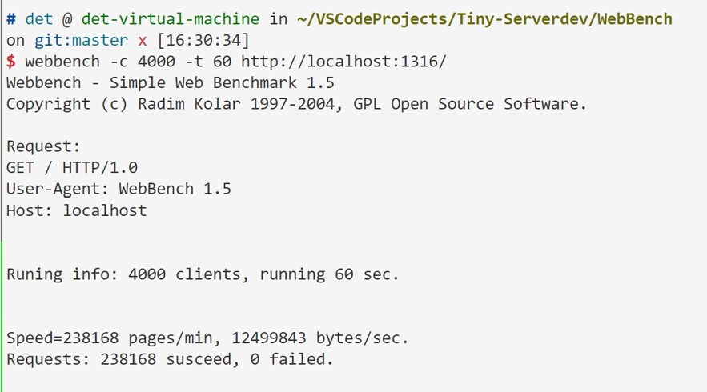

# Yet Another WebServer (aka YAWs)

## to-run

1. Requirements

     - Linux
     - clang version 16.0.6 (15)+
     - MySQL

2. Git Clone this repo

    ```shell
    git clone https://github.com/Detcher/YAWs.git
    ```

2. Configure MySQL

   - 下载MySQL
   - 设置用户和密码
   - 并创建数据库和表

3. Make
   
    编译之前需要配置main.cpp中的相关参数，例如MySQL配置，server监听的端口等。

    ```shell
    cd build
    make all
    ```
4. Run
   
    ```shell
    ./bin/server
    ```
5. WebBench Test
   
   测试前需要先编译WebBench。

    ```shell
    make install
    webbench -c CLIENT_NUMBER -t RUN_TIME http://ip:port/
    ```

## 测试结果



### 配置

- 虚拟机 8核4G
- 线程池 6个worker
- QPS ≈ 4000

## to-do

- [ ] coroutine?
- [ ] io-uring?
- [ ] data structure?
- [ ] application?
- [ ] . . . . . .
